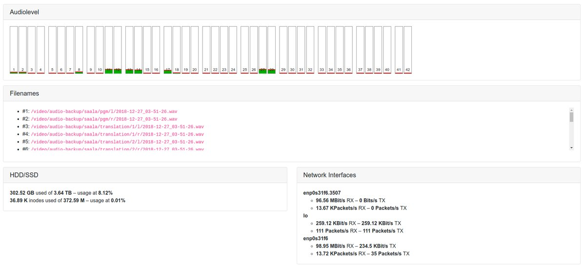

# A Linux/GStreamer-Based AES67 Multitrack Audio Recording Solution
Given you have an AES67 based Audio-over-IP Device or -Network and want to contiously record a given set of tracks uncompressed, then this might be for you.



On 34C3 we used tascam SSD-recorder to record all audio-tracks from all sub-groups to SSDs. this had some major drawbacks;
 * the recorder did record all 128 tracks and did not name them; so finding the ones of interest was quite hard
 * the recorder did not have NTP and their clocks were not set correctly
 * Someone had to unload the SSDs when they were full, carry them to an unloading-station, unload them and carry them back
 * The 120GB+ had do be copyied at-once every hours (whenever the SSDs were full) to the storage, spiking the network load
 * The backup files were hours long of multi-GB .wav-Files, so seeking in them (via network) was quite a challenge

On 35C3 we plan to fix these issues by capturing the Audio via AES67 and gstreamer to chunked, nicely named .wav-files, constantly syncing them to a storage-server.

## Configuration
For the time being, just take a look at [config.yaml](config.yaml).

## Requirements
```
# for the main recording application
apt-get install gstreamer1.0-plugins-base gstreamer1.0-plugins-good gstreamer1.0-tools libgstreamer1.0-0 gir1.2-gstreamer-1.0 gir1.2-gst-plugins-base-1.0
apt-get install python3 python3-yaml python3-paho-mqtt python3-gi

# for the web-gui application
sudo apt-get install python3-socketio-client python3-flask
```

## Running
The recorder itself is a headless application. It publishes status information via tcp on localhost port 9999.
```
./main.py -i my-config.yaml

nc 127.0.0.1 9999
```

A second application connects to this status-stream and serves a Web-UI on port 9998.
```
./web-ui.py -i my-config.yaml
```

The reason fo this split is, that a Web-UI with Websockets for live level-graphs does not fit nicely with the main recorder,
built around GObject/GStreamer.


## Troubleshooting
### Error-Message from gst_element_request_pad
```
gst_element_request_pad: assertion 'templ != NULL' failed
WARNING: erroneous pipeline: could not link audiotestsrc0 to mux_0, mux_0 can't handle caps audio/x-raw, format=(string)S24LE, rate=(int)48000, channels=(int)1
```

[Known Bug in GStreamer](https://bugzilla.gnome.org/show_bug.cgi?id=797241), a Problem with the `splitmuxsink` not able to
handle simple audio-only codecy, like `wavenc` a Patch has been merged to master which fixes this problem.
Until it landed in your Distribution, you probably need to build your own Version of GStreamer.
